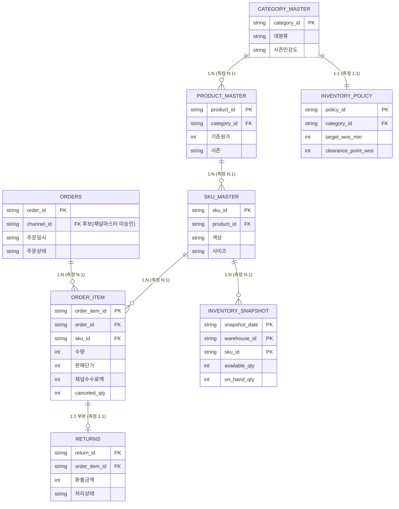

# 논리 ERD와 관계 검증

- 대상: 선정안 **필수 8개 테이블**만 사용 (보조·제외 테이블 미포함)
- 분석 기준일: **2026-07-31**
- 생성: `.venv/bin/python -m src.erd`

> 관계는 열 이름으로 확정하지 않았다. 이름은 후보로만 쓰고 **카디널리티는 데이터로 측정**했다.
> N:M으로 측정되는 관계는 조인을 실행하지 않는다.

---

## 1. 논리 ERD

### 관측단위

| 테이블             | 관측단위                   |   행수 | PK                                |
|:-------------------|:---------------------------|-------:|:----------------------------------|
| orders             | 주문 1건                   |  7,044 | order_id                          |
| order_item         | 주문 × SKU 1줄             |  8,831 | order_item_id                     |
| returns            | 반품 1건 (주문상세 단위)   |    410 | return_id                         |
| sku_master         | SKU 1개 (상품×색상×사이즈) |    399 | sku_id                            |
| product_master     | 상품 1개                   |     58 | product_id                        |
| category_master    | 카테고리 1개               |     19 | category_id                       |
| inventory_snapshot | 시점 × SKU 재고 1줄        | 12,369 | snapshot_date+warehouse_id+sku_id |
| inventory_policy   | 카테고리 정책 1건          |     19 | policy_id                         |

---

## 2. 추정 vs 실측 차이

**차이 1건.** 추정과 실측이 다른 항목이다.

| 검사구분      | 대상                              | 추정                                   | 실측          | 상세                                                                                  |
|:--------------|:----------------------------------|:---------------------------------------|:--------------|:--------------------------------------------------------------------------------------|
| 관측단위 검증 | inventory_snapshot: SKU당 창고 수 | SKU가 복수 창고에 존재 (재고 2배 위험) | 최대 1개 창고 | 시점당 행 수 [399], SKU 399개 → SKU는 한 창고에만 배정됨. 창고 합산 시 중복 위험 없음 |

---

## 3. 검증 결과

전체 결과는 `outputs/reports/relationship_validation.csv`에 있다.

### 3-1. PK·복합키 중복

| 대상                                                  | 추정            | 실측            | 일치   | 상세                        |
|:------------------------------------------------------|:----------------|:----------------|:-------|:----------------------------|
| orders(order_id)                                      | 중복 0 / 결측 0 | 중복 0 / 결측 0 | True   | 7,044행                     |
| order_item(order_item_id)                             | 중복 0 / 결측 0 | 중복 0 / 결측 0 | True   | 8,831행                     |
| returns(return_id)                                    | 중복 0 / 결측 0 | 중복 0 / 결측 0 | True   | 410행                       |
| sku_master(sku_id)                                    | 중복 0 / 결측 0 | 중복 0 / 결측 0 | True   | 399행                       |
| product_master(product_id)                            | 중복 0 / 결측 0 | 중복 0 / 결측 0 | True   | 58행                        |
| category_master(category_id)                          | 중복 0 / 결측 0 | 중복 0 / 결측 0 | True   | 19행                        |
| inventory_snapshot(snapshot_date+warehouse_id+sku_id) | 중복 0 / 결측 0 | 중복 0 / 결측 0 | True   | 12,369행                    |
| inventory_policy(policy_id)                           | 중복 0 / 결측 0 | 중복 0 / 결측 0 | True   | 19행                        |
| inventory_snapshot(snapshot_date+sku_id)              | 중복 0          | 중복 0          | True   | 고유 조합 12,369 / 12,369행 |
| inventory_snapshot(snapshot_date+warehouse_id+sku_id) | 중복 0          | 중복 0          | True   | 고유 조합 12,369 / 12,369행 |
| inventory_policy(category_id)                         | 중복 0          | 중복 0          | True   | 고유 조합 19 / 19행         |
| inventory_policy(category_id+season)                  | 중복 0          | 중복 0          | True   | 고유 조합 19 / 19행         |
| returns(order_item_id)                                | 중복 0          | 중복 0          | True   | 고유 조합 410 / 410행       |

### 3-2. FK 고아와 카디널리티

| 검사구분        | 대상                                                       | 추정   | 실측                              | 일치   | 상세                                                                                                                                                                                                                                                                                                                                                                                                                            |
|:----------------|:-----------------------------------------------------------|:-------|:----------------------------------|:-------|:--------------------------------------------------------------------------------------------------------------------------------------------------------------------------------------------------------------------------------------------------------------------------------------------------------------------------------------------------------------------------------------------------------------------------------|
| FK 고아         | order_item.order_id → orders.order_id                      | 고아 0 | 고아 0행 / 0종                    | True   | 검사 8,831행, 결측 0행 제외                                                                                                                                                                                                                                                                                                                                                                                                     |
| 연결 행 수 분포 | orders.order_id 1건당 order_item 행 수                     | N:1    | N:1 (최소 0 / 중위 1 / 최대 3)    | True   | 분포 → 0건:3, 1건:5,371, 2건:1,550, 3건:120                                                                                                                                                                                                                                                                                                                                                                                     |
| 관계 카디널리티 | order_item.order_id → orders.order_id                      | N:1    | N:1                               | True   | 자식키 고유=False, 부모키 고유=True, 연결 없는 부모 3건                                                                                                                                                                                                                                                                                                                                                                         |
| FK 고아         | order_item.sku_id → sku_master.sku_id                      | 고아 0 | 고아 0행 / 0종                    | True   | 검사 8,831행, 결측 0행 제외                                                                                                                                                                                                                                                                                                                                                                                                     |
| 연결 행 수 분포 | sku_master.sku_id 1건당 order_item 행 수                   | N:1    | N:1 (최소 0 / 중위 23 / 최대 50)  | True   | 분포 → 0건:1, 1건:3, 2건:8, 3건:10, 4건:13, 5건:8, 6건:8, 7건:10, 8건:5, 9건:10, 10건:5, 11건:11, 12건:6, 13건:10, 14건:14, 15건:5, 16건:9, 17건:9, 18건:8, 19건:17, 20건:7, 21건:8, 22건:11, 23건:14, 24건:10, 25건:12, 26건:6, 27건:14, 28건:14, 29건:12, 30건:20, 31건:11, 32건:11, 33건:11, 34건:6, 35건:3, 36건:8, 37건:5, 38건:7, 39건:3, 40건:11, 41건:8, 42건:3, 43건:5, 44건:2, 45건:1, 46건:2, 47건:2, 49건:1, 50건:1 |
| 관계 카디널리티 | order_item.sku_id → sku_master.sku_id                      | N:1    | N:1                               | True   | 자식키 고유=False, 부모키 고유=True, 연결 없는 부모 1건                                                                                                                                                                                                                                                                                                                                                                         |
| FK 고아         | returns.order_item_id → order_item.order_item_id           | 고아 0 | 고아 0행 / 0종                    | True   | 검사 410행, 결측 0행 제외                                                                                                                                                                                                                                                                                                                                                                                                       |
| 연결 행 수 분포 | order_item.order_item_id 1건당 returns 행 수               | 1:1    | 1:1 (최소 0 / 중위 0 / 최대 1)    | True   | 분포 → 0건:8,421, 1건:410                                                                                                                                                                                                                                                                                                                                                                                                       |
| 관계 카디널리티 | returns.order_item_id → order_item.order_item_id           | 1:1    | 1:1                               | True   | 자식키 고유=True, 부모키 고유=True, 연결 없는 부모 8,421건                                                                                                                                                                                                                                                                                                                                                                      |
| FK 고아         | sku_master.product_id → product_master.product_id          | 고아 0 | 고아 0행 / 0종                    | True   | 검사 399행, 결측 0행 제외                                                                                                                                                                                                                                                                                                                                                                                                       |
| 연결 행 수 분포 | product_master.product_id 1건당 sku_master 행 수           | N:1    | N:1 (최소 2 / 중위 8 / 최대 12)   | True   | 분포 → 2건:21, 6건:3, 8건:15, 9건:3, 12건:16                                                                                                                                                                                                                                                                                                                                                                                    |
| 관계 카디널리티 | sku_master.product_id → product_master.product_id          | N:1    | N:1                               | True   | 자식키 고유=False, 부모키 고유=True, 연결 없는 부모 0건                                                                                                                                                                                                                                                                                                                                                                         |
| FK 고아         | product_master.category_id → category_master.category_id   | 고아 0 | 고아 0행 / 0종                    | True   | 검사 58행, 결측 0행 제외                                                                                                                                                                                                                                                                                                                                                                                                        |
| 연결 행 수 분포 | category_master.category_id 1건당 product_master 행 수     | N:1    | N:1 (최소 3 / 중위 3 / 최대 4)    | True   | 분포 → 3건:18, 4건:1                                                                                                                                                                                                                                                                                                                                                                                                            |
| 관계 카디널리티 | product_master.category_id → category_master.category_id   | N:1    | N:1                               | True   | 자식키 고유=False, 부모키 고유=True, 연결 없는 부모 0건                                                                                                                                                                                                                                                                                                                                                                         |
| FK 고아         | inventory_snapshot.sku_id → sku_master.sku_id              | 고아 0 | 고아 0행 / 0종                    | True   | 검사 12,369행, 결측 0행 제외                                                                                                                                                                                                                                                                                                                                                                                                    |
| 연결 행 수 분포 | sku_master.sku_id 1건당 inventory_snapshot 행 수           | N:1    | N:1 (최소 31 / 중위 31 / 최대 31) | True   | 분포 → 31건:399                                                                                                                                                                                                                                                                                                                                                                                                                 |
| 관계 카디널리티 | inventory_snapshot.sku_id → sku_master.sku_id              | N:1    | N:1                               | True   | 자식키 고유=False, 부모키 고유=True, 연결 없는 부모 0건                                                                                                                                                                                                                                                                                                                                                                         |
| FK 고아         | inventory_policy.category_id → category_master.category_id | 고아 0 | 고아 0행 / 0종                    | True   | 검사 19행, 결측 0행 제외                                                                                                                                                                                                                                                                                                                                                                                                        |
| 연결 행 수 분포 | category_master.category_id 1건당 inventory_policy 행 수   | 1:1    | 1:1 (최소 1 / 중위 1 / 최대 1)    | True   | 분포 → 1건:19                                                                                                                                                                                                                                                                                                                                                                                                                   |
| 관계 카디널리티 | inventory_policy.category_id → category_master.category_id | 1:1    | 1:1                               | True   | 자식키 고유=True, 부모키 고유=True, 연결 없는 부모 0건                                                                                                                                                                                                                                                                                                                                                                          |

### 3-3. 단계별 조인 전후

| 대상                                                                | 추정                                   | 실측                                             | 일치   | 상세                                                                                                                   |
|:--------------------------------------------------------------------|:---------------------------------------|:-------------------------------------------------|:-------|:-----------------------------------------------------------------------------------------------------------------------|
| order_item (기준)                                                   | —                                      | 8,831행                                          | True   | 수량 9,114; 판매단가 522,451,800; 쿠폰할인액 4,976,600; 채널수수료액 32,148,919                                        |
| order_item ← sku_master(sku_id)                                     | 행 수·합계 불변 (left join, N:1)       | 행 8,831→8,831 / 합계 불변                       | True   | 수량 9,114→9,114; 판매단가 522,451,800→522,451,800; 쿠폰할인액 4,976,600→4,976,600; 채널수수료액 32,148,919→32,148,919 |
| sku_master ← product_master(product_id)                             | 행 수·합계 불변 (left join, N:1)       | 행 8,831→8,831 / 합계 불변                       | True   | 수량 9,114→9,114; 판매단가 522,451,800→522,451,800; 쿠폰할인액 4,976,600→4,976,600; 채널수수료액 32,148,919→32,148,919 |
| product_master ← category_master(category_id)                       | 행 수·합계 불변 (left join, N:1)       | 행 8,831→8,831 / 합계 불변                       | True   | 수량 9,114→9,114; 판매단가 522,451,800→522,451,800; 쿠폰할인액 4,976,600→4,976,600; 채널수수료액 32,148,919→32,148,919 |
| order_item ← orders(order_id)                                       | 행 수·합계 불변 (left join, N:1)       | 행 8,831→8,831 / 합계 불변                       | True   | 수량 9,114→9,114; 판매단가 522,451,800→522,451,800; 쿠폰할인액 4,976,600→4,976,600; 채널수수료액 32,148,919→32,148,919 |
| order_item ← returns(order_item_id)                                 | 1:1이면 행 수 불변                     | 행 8,831→8,831                                   | True   | 반품 410행 중 매칭 410행                                                                                               |
| inventory_snapshot ← sku_master ← product_master ← inventory_policy | 행 수·재고 합계 불변                   | 행 12,369→12,369 / available_qty 311,501→311,501 | True   | 3단계 연속 left join                                                                                                   |
| inventory_snapshot: SKU당 창고 수                                   | SKU가 복수 창고에 존재 (재고 2배 위험) | 최대 1개 창고                                    | False  | 시점당 행 수 [399], SKU 399개 → SKU는 한 창고에만 배정됨. 창고 합산 시 중복 위험 없음                                  |

---

## 4. N:M 조인 처리

승인된 8개 테이블 사이에 **N:M 관계는 측정되지 않았다.** 전부 1:1 또는 N:1이라 조인을 보류한 관계는 없다.

다만 선정안에서 **제외**한 `order_attribution`(주문당 최대 2행)과 `promotion_application`은 상위 테이블과 다대다가 될 수 있어, 필요해지면 이 검증을 먼저 다시 돌린다.